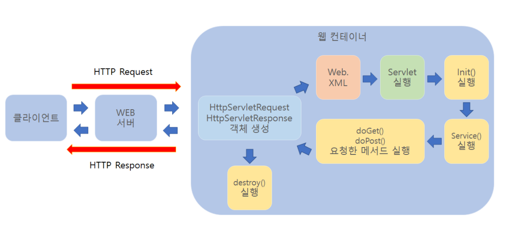

# 🗓️ 2025.05.29 (목) – 교육 일지

## 📚 오늘 배운 내용

### SERVLET
- web 통신 구조
  - Web Server
  - Web Application Server
- process와 thread
  - process와 thread의 차이
  - multi process
  - multi thread
- servlet
  - servlet이란?
    
    - 동적 웹페이지를 만들 때 사용되는 자바 기반의 웹 어플리케이션 프로그래밍 기술
    - 서블릿은 웹 요청과 응답의 흐름을 간단한 메소드 호출만으로 체계적으로 다룰 수 있게 해준다.
  - servlet의 특징
    - 클라이언트의 Request에 대해 동적으로 작동하는 웹 어플리케이션 컴포넌트
    - 기존의 정적 웹 프로그램의 문제점을 보완하여 동적인 기능 제공
    - JAVA의 스레드를 이용하여 동작
    - MVC 패턴에서 컨트롤러로 이용됨
    - 컨테이너에서 실행
    - 보안 기능을 적용하기 쉬움
  - servlet의 동작과정
    
  - servlet container(Web Application Server)
    - 서블릿 생명주기 메소드

## 💻 실습 예시

### MYBAITS
- [팀 실습 : mybatis-crud](https://github.com/C1Z4/mybatis-crud-practice)

### SERVLET
- [thread](../../SERVLET/chatper00-thread)
- [life-cycle](../../SERVLET/chapter01-life-cycle)

## ✍️ 오늘의 회고
- 오늘은 웹 애플리케이션의 기본 개념인 Servlet과 Thread, 그리고 Web 통신 구조에 대해 배웠다. 지금까지는 웹 요청이나 응답이 어떻게 흘러가는지 막연하게만 알고 있었는데, 오늘 수업을 통해 Web Server와 WAS의 역할 차이를 좀 더 명확히 이해할 수 있었다.
- 특히 Servlet의 동작 과정과 생명주기를 정리하면서, 단순히 메서드 하나하나를 구현하는 것 이상의 큰 흐름이 있다는 걸 느꼈다. 앞으로는 코드를 작성할 때도 이 흐름을 의식하면서 짜야겠다는 생각이 들었다.
- 또한 Thread와 Process의 개념 차이도 다시 정리할 수 있어서 좋았다. Java 기반 웹 프로그래밍이 결국 Thread 기반이라는 걸 알게 되니, 향후 동시성 이슈나 요청 처리 방식에도 좀 더 깊이 있게 접근할 수 있을 것 같다.