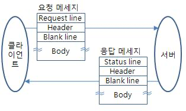
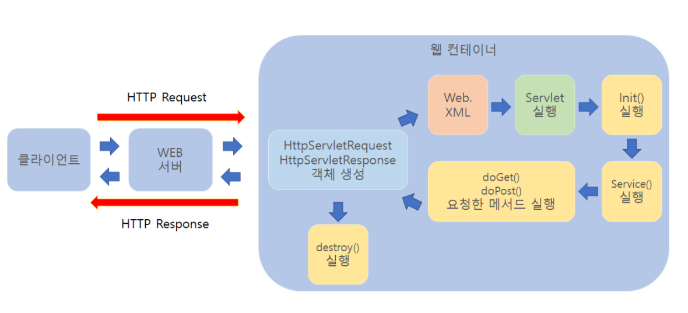
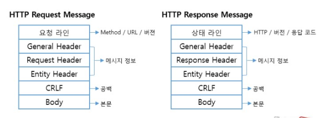

# 🗓️ 2025.05.30 (금) – 교육 일지

## 📚 오늘 배운 내용

### SERVLET
- HTTP 데이터 전송 방식
  - 메세지 교환 형태의 데이터 전송 구조
    
    - 클라이언트와 서버 간에 **HTTP 메세지**를 주고 받으며 통신
    - 요청-응답의 형태이며 클라이언트에 의해서만 시작된다.
  - Request와 Response
    
    - 전달받은 HTTP 객체를 서버(=Tomcat)가 해석하여 요청을 처리할 서블릿 호출(Web XML)
    - 서블릿의 service() 메소드에서 request, response 요청 정보를 가지고 처리 로직을 거쳐 응답
    - HttpServletRequest는 ServletRequest 인터페이스를 확장한 하위 인터페이스이며, HTTP 요청과 관련된 추가 기능들을 제공한다.
    - 우리가 실제로 사용하는 건 HTTP 기반 요청이기 때문에, HTTP 관련 메서드들이 정의되어 있는 HttpServletRequest 타입으로 다운 캐스팅해서 사용해야 한다.
      ```
      @WebServlet("/request-service")
      public class ServiceMethodTestServlet extends HttpServlet {

      @Override
      public void service(ServletRequest request, ServletResponse response) throws ServletException, IOException {
          HttpServletRequest httpRequest = (HttpServletRequest) request;
          HttpServletResponse httpResponse = (HttpServletResponse) response;
      
      }
      ```
  - 메세지 구조
    
    - request(요청) 메세지 구조
      - Start Line(요청 라인)
        - 예시 : `GET/login HTTP/1.1` 
          - 확인 코드
            ```
            protected void doGet(HttpServletRequest request, HttpServletResponse response) throws IOException {
                System.out.println("Method: " + request.getMethod());           // GET
                System.out.println("Request URI: " + request.getRequestURI()); // /login
                System.out.println("Protocol: " + request.getProtocol());      // HTTP/1.1
            }
            ```
        - HTTP 메소드, URL, 버전으로 구성되어있다.
        - HTTP 메소드 : HTTP 메소드를 통해 서버가 수행해야 할 동작을 지정하는 요청을 보낸다.
          - GET : 리소스 조회
            - 예시 : `http://localhost:8080/querystring?name=냥냥&age=33&birthday=2025-05-12` 
            - 클라이언트가 서버에 데이터를 보낼 때, GET 방식에서는 쿼리스트링 방식으로, 요청 URL의 경로 뒤에 ?를 붙여 key=value 형태로 데이터를 전달한다. 
            - 여러 데이터를 보낼 때는 &로 구분한다.
            - 데이터 검색에 주로 사용되며, 데이터 크기 한계가 있고 보안에 취약하다.
          - POST: 요청 데이터 처리, 주로 등록에 사용
            - HTTP header 내용으로 데이터를 전송한다.
            - 전송 데이터 크기에 제한이 없고, header에 포함해 전송하므로 보안이 뛰어나다.
          - PUT :리소스를 대체(덮어쓰기), 해당 리소스가 없으면 생성
          - PATCH :리소스 부분 변경 (PUT이 전체 변경, PATCH는 일부 변경)
          - DELETE :리소스 삭제
        - URL : Request target, 해당 request가 전송되는 목표 url
        - HTTP version : HTTP 버전을 의미, 주로 1.1 버전이 널리 쓰인다. 
                

## 💻 실습 예시

### SERVLET
- 

## ✍️ 오늘의 회고
- 