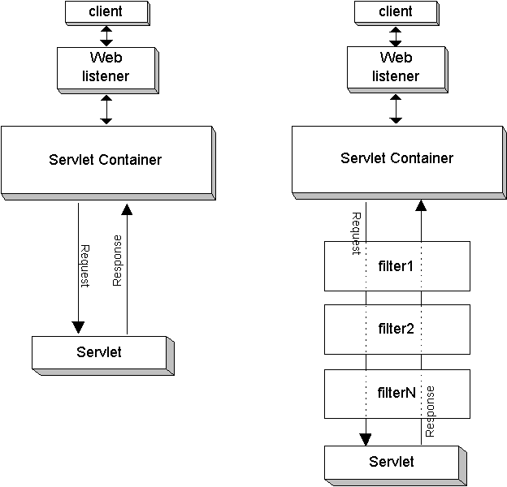

# 🗓️ 2025.06.02 (월) – 교육 일지

## 📚 오늘 배운 내용

### SERVLET
- ### forward와 redirect

    | 구분       | Forward    | Redirect    |
    | -------- |------------|-------------|
    | 처리 주체    | 서버 내부      | 클라이언트가 새 요청 |
    | 주소창(URL) | 바뀌지 않음     | 바뀜          |
    | 요청/응답 흐름 | 같은 요청 객체 공유 | 새로운 요청 발생   |
    | 사용 예시    | 메일 조회      | 쇼핑몰 결제창     |
---
- ### cookie와 session
   
    | 항목     | Cookie            | Session            |
  | ------ | ----------------- | ------------------ |
  | 저장 위치  | 클라이언트(브라우저)       | 서버                 |
  | 식별자 관리 | key-value 자체 저장   | 세션 ID를 쿠키로 관리      |
  | 보안     | 상대적으로 낮음          | 상대적으로 높음           |
  | 지속성    | 브라우저 종료 전/후 설정 가능 | 기본적으로 브라우저 종료 시 소멸 |

---
- ### filter
  - `jakarta.servlet.Filter` 인터페이스를 구현한 클래스이다.
  - 서블릿이나 JSP가 실행되기 전에 요청(Request)을 가로채거나, 응답(Response)이 클라이언트로 가기 전에 처리할 수 있는 컴포넌트  
  - 주로 요청/응답 변형, **인증 및 권한 부여**, 로깅 및 감시를 목적으로 사용한다.
  - `@WebFilter` 어노테이션을 통해 매핑 할 수 있다. 
  - 단, filter가 여러 개일 경우 적용 순서를 제어할 수 없기 떄문에 `web.xml`파일에 작성하는 것을 추천한다.
  - Filter 인스턴스는 최초 한 번만 생성된다. (init(), destroy()도 최초 한번만 실행된다.) 
  - 동작 흐름 (왼쪽 : filter가 없을 때, 오른쪽 : filter가 있을 때)
    
    ```
    [사용자 요청] 
        ↓
    [Web Application Server 톰캣 실행] -> [@WebFilter("/first/*") 필터 발견 -> doFilter() 호출]
        ↓
    [Filter1 : 전처리 후] -> filterChain.doFilter()]
        ↓
    [Filter2 : 전처리 후] -> filterChain.doFilter()]
        ↓
    [더 이상 필터 없음] -> [톰캣이 최종 서블릿 매핑 확인(톰캣 내부에서 실행)] -> [FirstFilterTestServlet의 doGet() 호출]
        ↓
    [응답 전송]
        ↓
    [Filter2 후처리]
    ```
    
---

- ### Servlet과 JSP
    - | 항목             | **Servlet**                                                | **JSP (JavaServer Pages)**                                         |
      | -------------- | ---------------------------------------------------------- | ------------------------------------------------------------------ |
      | **정의 및 구조**    | 순수 Java 코드로 구성된 웹 서버용 클래스 (동적 웹페이지 생성용)                    | HTML 문서에 Java 코드를 삽입한 스크립트 형태의 언어                                  |
      | **코드 작성 방식**   | Java 코드 속에 HTML을 문자열로 삽입하여 출력 (`out.println()`)            | HTML 코드 속에 Java 코드를 `<% %>`, `<%= %>` 형태로 삽입                       |
      | **가독성**        | Java 중심이라 복잡한 HTML UI 작성이 불편함                              | HTML 중심이라 UI 작성이 쉽고 직관적임                                           |
      | **한계 및 보완 관계** | - 화면 구현 시 코드 복잡도 ↑<br>- 빌드 후 테스트 불편<br>- HTML 수정 시 재컴파일 필요 | - HTML 중심 작성으로 생산성 ↑<br>- WAS가 자동으로 서블릿으로 변환 및 컴파일<br>- 코드 유지보수 용이 |
      | **컴파일**        | 수동으로 Java 코드를 작성하고 컴파일 필요                                  | 최초 요청 시 JSP가 자동으로 서블릿으로 변환되어 컴파일됨                                  |
      | **주 용도**       | 로직 처리 중심 (비즈니스 로직, 데이터 처리 등)                               | 화면 처리 중심 (출력, UI 등)                                                |
      | **MVC 패턴 역할**  | **Controller**: 클라이언트 요청 처리, 비즈니스 로직 실행                    | **View**: 사용자에게 보여줄 결과 페이지 렌더링                                     |
      | **실행 위치**      | 웹 서버에서 Java 코드 실행                                          | 웹 서버에서 Java 코드 실행 후 HTML 결과 전송                                     |
  - 실제 서비스에서는 보통 Servlet + JSP 조합(MVC 구조)로 개발한다.
  - Servlet
    - Java 클래스로 작성된 서버 측 프로그램
    - 클라이언트(브라우저)의 요청(Request)을 받아서 처리하고, 그 결과를 응답(Response)으로 되돌려준다.
    - 동작 흐름
      ```
      [클라이언트 요청]
            ↓
      [Web Application Server (Tomcat) == Servlet Container 실행]
            ↓
      [Servlet Container가 요청 분석]
            ↓
      [해당 Servlet 클래스 실행]
            ↓
      [service() → doGet() / doPost()]
            ↓
      [비즈니스 로직 처리 + 응답 생성]
            ↓
      [HTML 형태로 응답 반환]
            ↓
      [클라이언트에게 응답 전송]
      ```
    - Servlet Contatiner의 동작 과정
      - (1) 사용자가 `http://localhost:8080/print` 로 요청을 보냄
      - (2) 톰캣이 `web.xml` 또는 어노테이션(@WebServlet)으로 등록된 `/hello` 매핑을 찾음
      - (3) `/hello`으로 매핑된 해당 서블릿 인스턴스를 Servlet Container가 생성 or 재사용
      - (4) `service()`메소드 호출 -> HTTP method에 따라 doGet() 또는 doPost() 실행
      - (5) 요청 처리 후 HtttpServletResponse로 결과 반환
  - JSP
    - HTML 안에 Java 코드를 포함한 템플릿
    - 톰캣과 같은 WA의 내부에 있는 JSP 컨테이너를 통해 Servlet으로 변환되어 실행된다.
    - 동작흐름
      ```
      [클라이언트 요청 → *.jsp]
           ↓
      [Web Application Server (Tomcat)]
           ↓
      [JSP Engine(JSP Container)]
           ↓
      [.jsp → .java(Servlet)로 변환]
           ↓
      [.java → .class로 컴파일]
           ↓
      [Servlet처럼 실행]
           ↓
      [결과 HTML 생성 및 응답 반환]
      ```
    - JSP Contatiner의 동작 과정
      - (1) `.jsp` 파일을 Servlet 코드로 변환
      - (2) 변환된 `.java` 파일을 컴파일 -> `.class` 파일 생성
      - (3) 이후 Servlet처럼 동작하여 요청에 대한 응답 생성
    - JSP 태그
      
       | 구분                    | 태그                          | 설명                              | 예시                                                                                                                                                                       |
        | --------------------- | --------------------------- | ------------------------------- |--------------------------------------------------------------------------------------------------------------------------------------------------------------------------|
        | **1. 페이지 지시자 태그**     | `<%@ page ... %>`           | JSP 페이지의 속성(인코딩, 에러 처리 등)을 지정   | `<%@ page contentType="text/html; charset=UTF-8" %>`<br>`<%@ page import="java.util.Date" %>`<br>`<%@ page errorPage="error.jsp" %>`<br>`<%@ page isErrorPage="true" %>` |
        | **2. 주석 태그**          | `<%-- 주석 --%>`              | JSP 내부 주석 (HTML에 출력되지 않음)       | `<%-- 이 코드는 현재 날짜를 출력합니다 --%>`                                                                                                                                           |
        | **3. 선언 태그**          | `<%! ... %>`                | 클래스 멤버 필드/메서드를 정의 (전역 변수, 함수 등) | `<%! int count = 0; %>`<br>`<%! public String greet() { return "Hello"; } %>`                                                                                            |
        | **4. 스크립틀릿 태그**       | `<% ... %>`                 | Java 코드를 JSP 안에 삽입 (로직 작성)      | `<% for (int i = 0; i < 3; i++) { %><p>i = <%= i %></p><% } %>`                                                                                                          |
        | **5. 표현식 태그**         | `<%= ... %>`                | Java 변수나 값을 출력 (HTML로 응답)       | `name : <%= name %>`                                                                                                                                                     |
        | **6. include 지시자 태그** | `<%@ include file="..." %>` | JSP 파일을 **컴파일 타임에 포함**          | `<div><%@ include file="today.jsp" %></div>` // today.jsp 파일 실행                                                                                                          |
        | **7. taglib 지시자 태그**  | `<%@ taglib ... %>`         | JSTL이나 사용자 정의 태그를 사용            | `<%@ taglib prefix="c" uri="http://java.sun.com/jsp/jstl/core" %>`<br>`<c:if test="${user != null}">환영합니다!</c:if>`                                                       |

## 💻 실습 예시

### SERVLET
- [forward](../../SERVLET/chapter07-forward)
- [redirect](../../SERVLET/chapter08-redirect)
- [cookie](../../SERVLET/chapter09-cookie)
- [session](../../SERVLET/chapter10-session)
- [filter](../../SERVLET/chapter11-filter)
- [jsp](../../SERVLET/chapter12-jsp)

## ✍️ 오늘의 회고
- 