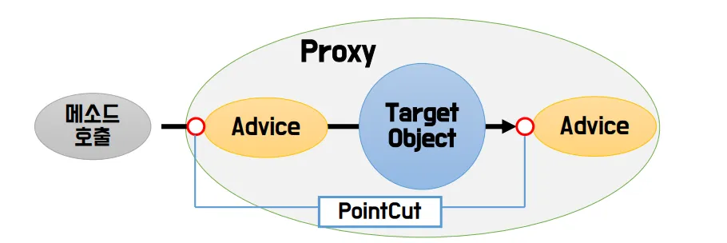

# 🗓️ 2025.06.04 (수) – 교육 일지

## 📚 오늘 배운 내용

### Spring FrameWork
- 의존성 주입(Dependency Injection)
  - 의존성 주입 어노테이션
    - | 어노테이션             | 역할/기능 요약                        | 언제 사용하나?                     | 스프링이 관리하는 객체인가?           |
      | ----------------- | ------------------------------- | ---------------------------- | ------------------------- |
      | `@Component`      | 기본 컴포넌트 지정                      | 가장 일반적인 Bean 등록용 (직접 만든 클래스) | ✅                         |
      | `@Service`        | 서비스 계층 컴포넌트                     | 비즈니스 로직을 담는 클래스              | ✅                         |
      | `@Repository`     | DAO 계층 컴포넌트                     | DB 연동 클래스 (JPA, JDBC 등)      | ✅ + 예외 변환 기능              |
      | `@Controller`     | MVC 컨트롤러 지정                     | 웹 요청을 처리하는 클래스               | ✅ + MVC 기능 사용             |
      | `@RestController` | `@Controller` + `@ResponseBody` | JSON 응답용 REST API            | ✅                         |
      | `@Configuration`  | 설정 클래스 지정                       | Bean 등록 메서드를 포함한 클래스에 사용     | ✅ (내부적으로 `@Component` 포함) |
      | `@Bean`           | 수동 Bean 등록                      | 외부 라이브러리나 직접 생성 로직이 필요한 경우   | ❌ (메서드 단위 등록)             |
      - `@Service`, `@Repository`, `@Controller`은 내부적으로  `@Component` 기반이다.
      - 스프링이 관리하지 않는 클래스, 메소드의 경우 `@Configuration` + `@Bean` 조합 사용
      - Bean 스캔 방법
        - (1) `@Configuration` + `@ComponentScan(basePackages = "com.section01")`
          - com.section01 패키지 이하의 @Component 계열을 스캔
          - 설정 클래스에서 전체 프로젝트의 Bean을 스캔할 때 사용
          - `@Bean`도 인식된다.
        - (2) `ApplicationContext context = new AnnotationConfigApplicationContext("com.section01");`
          - `@Configuration`이 없어도 Bean 스캔 가능
          - com.section01 패키지 이하에 있는 `@Component`,` @Service`, `@Repository` 등을 찾아서 Bean으로 등록
          - 단, `@Bean`은 인식되지 않음 (`@Bean`은 `@Configuration` 안에서만 작동)
          - 동작 순서
            - @Configuration 클래스 (만약 @@Configuration이 등록되어있는 클래스가 location일 때) 또는 "com.section01"에 있는 컴포넌트들을 읽음
            - @Bean 메서드를 통해 정의된 객체들을 모두 인스턴스화 또는 "com.section01"에 있는 컴포넌트들을 인스턴스화
            - 각 Bean에 대해 필요한 의존성을 주입
            - 
  - 의존성 주입의 종류
    - | 주입 방법            | 설명                  | 특징 / 장단점                                                                              |
      | ---------------- | ------------------- | ------------------------------------------------------------------------------------- |
      | **1. 생성자 주입**    | 생성자를 통해 의존 객체를 주입   | ✅ **불변성 보장**<br>✅ 테스트 용이 (Mock 주입 쉬움)<br>✅ 의존성 누락 방지 (null 방지)<br>❌ 의존성 많을 경우 생성자 길어짐 |
      | **2. 필드 주입**     | 필드에 직접 `@Autowired` | ✅ 코드 간결<br>❌ **테스트 어려움** (필드 접근 제한)<br>❌ 순환 참조 문제 찾기 어려움<br>❌ 불변성 보장 X                |
      | **3. Setter 주입** | setter 메서드를 통해 주입   | ✅ 선택적 의존성 가능<br>✅ 초기화 이후에도 값 변경 가능<br>❌ 의존성 누락 위험<br>❌ 불변성 보장 X                       |
    - 코드 예시
      - 생성자 주입 : 생성자 쪽에 @Autowired 어노테이션을 붙인 것
        ```
        @Service("bookServiceConstructor")
         public class BookService {
             private final BookDAO bookDAO;
    
             // 생성자가 두 개 이상일 때는 반드시 어노테이션을 붙여야 하지만 하나일 경우에는 생략해도 상관 없다.
             @Autowired
             public BookService(BookDAO bookDAO) {
                 this.bookDAO = bookDAO;
             }
         
             public List<BookDTO> selectAllBooks() {
                 return bookDAO.selectBookList();
             }
        }
        ```
        - 생성자 주입의 내부 동작
          - (1) 스프링이 @ComponentScan 또는 직접 등록한 설정 클래스에서 @Service가 붙은 BookService 클래스를 스캔함
          - (2) @Autowired가 붙은 생성자를 찾거나 생성자가 1개뿐이면 자동으로 사용 (이 경우 @Autowired 생략 가능)
          - (3) 생성자 매개변수로 BookDAO 타입이 있으므로, 이미 등록된 BookDAO Bean을 컨테이너에서 찾아서 준비함
          - (4) this.bookDAO = bookDAO;가 생성자 내부에서 실행돠면서 BookService 인스턴스 생성 (BookService 객체가 생성될 때 의존성이 주입됨 -> final 키워드 사용 가능)
          - (5) 생성된 BookService 객체를 Spring Container에 등록 (Bean으로 관리됨)
      - 필드 주입 : 필드 쪽에 @Autowired 어노테이션을 붙인 것, 불변성 보장이 되지 않아 final을 사용할 수 없다. (권장 x)
        ```
        @Service("bookServiceField")
        public class BookService {
            @Autowired
             private BookDAO bookDAO;
        
            public List<BookDTO> selectAllBooks() {
                return bookDAO.selectBookList();
            }
        }
        ```
      - setter 주입 : set 메소드에 @Autowired 어노테이션을 붙인 것, 불변성 보장이 되지 않아 final을 사용할 수 없다. (권장 x)
        ```
        @Service("bookServiceSetter")
        public class BookService {
            private BookDAO bookDAO;
        
            /* BookDAO 타입의 빈 객체를 setter에 자동으로 주입해준다. */
            // setter도 final을 사용할 수 없어 불변성을 보장할 수 없다.
            // 기본 생성자를 통해 생성되고 setter함수를 호출하여 BookDAO를 초기화하고 있다.
            @Autowired
            public void setBookDAO(BookDAO bookDAO) {
                this.bookDAO = bookDAO;
            }
        
            public List<BookDTO> selectAllBooks() {
                return bookDAO.selectBookList();
            }
        }
        ```
        - setter 주입의 내부 동작
          - (1) Spring이 @ComponentScan 또는 new AnnotationConfigApplicationContext()를 통해 @Service, @Repository, @Component 등 어노테이션이 붙은 클래스를 스캔해 빈으로 등록
          - (2) BookService 클래스는 생성자 없음 → Spring이 기본 생성자로 **객체를 먼저 생성함**.
          - (3) @Autowired가 붙은 setter 메서드를 찾음 → setBookDAO(BookDAO) 발견
          - (4) Spring이 BookDAO 타입의 Bean을 찾아서 setBookDAO()에 전달함
          - (5) this.bookDAO = bookDAO; 실행됨 → 의존 객체가 필드에 주입됨
    - 생성자 주입만 final이 가능한 이유
      - | 주입 방식                  | 주입 시점                      | `final` 사용 가능 여부 | 이유                                            |
        | ---------------------- | -------------------------- | ---------------- | --------------------------------------------- |
        | **생성자 주입**             | 객체 생성 시점 (= 생성자 호출 시)      | ✅ 가능             | 객체가 만들어질 때 단 한 번 초기화되기 때문에 `final` 사용 가능      |
        | **필드 주입 (@Autowired)** | 객체 생성 후, **리플렉션으로 주입**     | ❌ 불가능            | 이미 생성된 객체에 나중에 값을 "주입"하는 거라 `final` 필드에는 못 넣음 |
        | **Setter 주입**          | 객체 생성 후, **setter 메서드 호출** | ❌ 불가능            | setter 호출도 객체 생성 이후의 일이라 `final` 필드를 설정할 수 없음 |
- `@Primary`와 `@Qualifier`
  - | 항목        | `@Primary`                              | `@Qualifier`                       |
    | --------- | --------------------------------------- | ---------------------------------- |
    | **용도**    | 여러 Bean 중 **우선적으로 선택할 Bean** 지정         | 여러 Bean 중 **명시적으로 특정 이름의 Bean 선택** |
    | **적용 대상** | Bean 정의할 때 (클래스 또는 메서드)                 | 주입 받을 때 (필드, 생성자, 세터 등)            |
    | **선택 기준** | 자동 주입 시, **자동으로 우선 순위 부여**              | **직접 Bean 이름을 명시**해서 선택            |
    | **우선순위**  | `@Qualifier`가 지정되면 `@Primary`보다 **우선됨** | 항상 **정확히 일치하는 이름의 Bean을 선택**       |
    | **사용 예시** | 기본으로 주입될 구현체 지정 시                       | 명확하게 어떤 구현체를 쓸지 지정할 때              |
- bean scope
  - 스프링 빈이 생성될 때 생성되는 인스턴스의 범위를 의미한다. 스프링에서는 다양한 Bean scope를 제공한다.
    - singleton : 하나의 인스턴스만을 생성하고, 모든 빈이 해당 인스턴스를 공유하며 사용한다. (Bean의 default값)
    - prototype : 매번 새로운 인스턴스를 생성한다. (Bean을 생성하는 곳에 `@Scope("prototype")`을 적어준다.)
    - request : HTTP 요청을 처리할 때마다 새로운 인스턴스를 생성하고, 요청 처리가 끝나면 인스턴스를 폐기한다.
    - session : HTTP 세션 당 하나의 인스턴스를 생성하고, 세션이 종료되면 인스턴스를 폐기한다.
    - globalSession : 전역 세션 당 하나의 인스턴스를 생성하고, 전역 세션이 종료되면 인스턴스를 폐기한다.
- init method와 destroy method
  - init method : 스프링 컨테이너가 해당 Bean 객체를 생성한 직후에 자동으로 호출되는 메소드, ApplicationContext 생성 바로 직후 실행된다. 
  - destroy method : 스프링 컨테이너가 종료될 때, 해당 Bean을 소멸시키기 직전에 호출되는 메서드, 보통 정리(clean-up) 작업에 사용됨 (ex. 자원 반환, 연결 종료 등), 가비지 컬렉터가 해당 빈을 메모리에서 지울 때 destroy 메소드가 동작하게 되는데 메모리에서 지우기 전에  프로세스는 종료`.close()`를 필수적으로 해줘야 한다.
  - 설정 방법
    - (1) `@Bean`에 기술하는 방식
      ```
      @Bean(initMethod = "openShop", destroyMethod = "closeShop")
      public Owner owner() {
          return  new Owner();
      }
      ```
    - (2) 메소드 위에 기술하는 방식
      ```
      /* init method와 같은 설정 어노테이션 */
      @PostConstruct
      public void openShop() {}
  
      /* destroy method와 같은 설정 어노테이션 */
      @PreDestroy
      public void closeShop() {}
      ```
- `.properties`를 통해 필드 초기화하기
  - configuration 파일에 `@PropertySource(String properties 경로)`를 통해 properties 파일 경로 지정 (.properties의 파일의 경로와 class의 파일 경로가 같아야 한다.)
  - 치환자 문법을 이용하여 properties에 저장된 Key를 입력하면 value에 해당하는 값을 꺼내온다.
    - 필드에 어노테이션 적는 방식
      ```
      @Value("${bread.carpbread.name}")
      private String carpBreadName;
      ```
    - 매개변수에 어노테이션 적는 방식
      ```
      @Bean
      public Product water(@Value("${beverage.water.name}") String waterName,
                           @Value("${beverage.water.price}") int waterPrice,
                           @Value("${beverage.water.capacity}") int waterCapactity) {
          return new Beverage(waterName, waterPrice, waterCapactity);
      }
      ```
- AOP(Aspect Orianted Programming)
  - AOP는 관점 지향 프로그래밍의 약자이며 객체 지향 프로그래밍의 한계를 보완하기 위한 프로그래밍 패러다임
  - 해심 기능과 부가 기능을 분리하여 각각을 독립적으로 관리하고, 필요에 따라 모듈화하여 재사용할 수 있도록 함.
  - AOP는 특히 횡당 기능(로그, 트랙잭션, 인증 등)이 많은 애플리케이션에서 효과적으로 활용될 수 있다.
  - AOP 핵심 용어
    - Aspect : 핵심 비지니스 로직과는 별도로 수행되는 횡단 관심사를 말한다.
    - Advice : Aspect의 기능 자체를 말한다.
    - Joinpoint : Advice가 적용될 수 있는 위치를 말한다.
    - Pointcut : Joinpoint 중에서 Advice가 적용될 가능성이 있는 부분을 선별한 것을 말한다.
    - Weaving : Advice를 핵심 비지니스 로직에 적용하는 것을 말한다.
  - Advice의 종류 
    - Before : 대상 메소드가 실행되기 이전에 실행되는 어드바이스
    - After-returning : 대상 메소드가 정상적으로 실행된 이후에 실행되는 어드바이스
    - After-throwing : 예외가 발생했을 때 실행되는 어드바이스
    - After : 대상 메소드가 실행된 이후에 (정상, 예외 관계없이) 실행되는 어드바이스
    - Around : 대상 메소드 실행 전/후에 적용되는 어드바이스
  - Spring AOP의 특징
    - 
    - 프록시 기반의 AOP 구현체 : 대상 객체(Target Object)에 대한 프록시를 만들어 제공, 타켓을 감싸는 프록시서버는 Runtime시에 생성된다.
    - 메서드 조인 포인트만 제공 : 핵심기능(대상 객체)의 메소드가 호출되는 런타임 시전에만 부가기능(어드바이스)을 적용할 수 있다.
      
## 💻 실습 예시

### Spring FrameWork
- [의존성 주입](../../SPRING/chapter03-di-annotation)
- [bean 스코프, init method와 destroy method](../../SPRING/chapter04-bean)

## ✍️ 오늘의 회고
- 오늘은 Spring Framework에서 가장 핵심이라고 할 수 있는 **의존성 주입(DI)**에 대해 배웠다.
- 사실 이전까지는 그냥 @Autowired 붙이면 되는 줄 알았는데, 생성자 주입, 필드 주입, 세터 주입이 각각 어떤 특징을 갖고 있고 왜 생성자 주입이 권장되는지 확실히 이해하게 됐다. 
- 특히, 생성자 주입만 final을 사용할 수 있는 이유가 객체 생성 시점 때문이라는 걸 깨달으니까 구조적으로 훨씬 명확하게 보였다. 앞으로 코드를 짤 때도 이 점을 꼭 반영해야겠다고 다짐했다.
- 그리고 @Component, @Service, @Repository, @Controller, @Configuration, @Bean 같은 스프링에서 자주 쓰이는 어노테이션들에 대해 한눈에 정리할 수 있어서 좋았다.
이제 어떤 클래스에 어떤 어노테이션을 붙여야 할지 더 이상 헷갈리지 않을 것 같다.
- @Qualifier랑 @Primary의 차이도 오늘 확실히 알았다. 비슷하게 생겨서 대충 넘어갔었는데, **자동 주입 시 기본값을 줄 땐 @Primary, 명시적으로 Bean을 지정할 땐 @Qualifier**라는 규칙을 확실히 기억해야겠다.