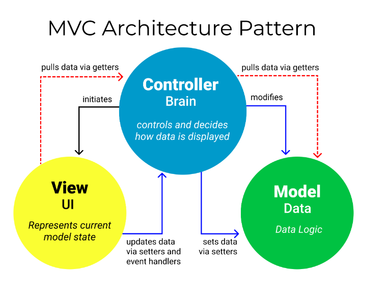
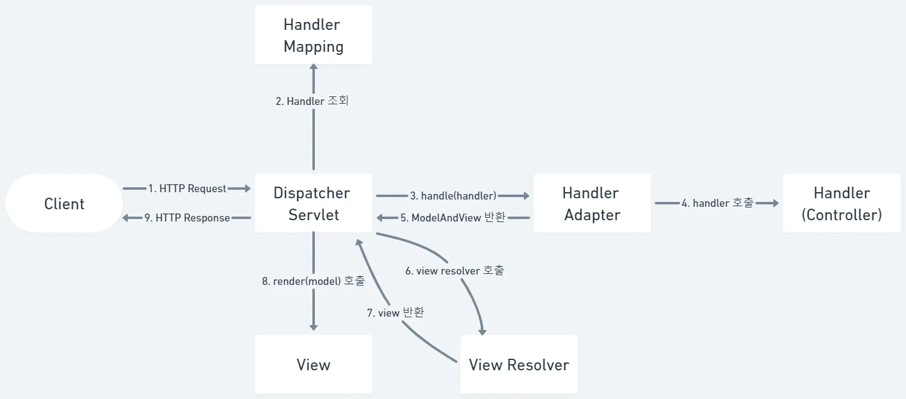

# 🗓️ 2025.06.05 (목) – 교육 일지

## 📚 오늘 배운 내용
### Spring Boot

#### 스프링 부트란?
- 필요한 환경 설정을 최소화하고 개발자가 비지니스 로직에 집중할 수 있도록 스프링의 단점을 보완하여 만든 프로젝트
- 스프링부트는 스프링프레임워크라는 큰 틀 속에 속하는 도구이다.
- 특징
  - JAR을 사용하여 자바 옵션만으로 배포 가능
  - 번거로운 XML 설정을 요구하지 않음
  - 별도의 외장 톰캣을 설치할 필요가 없고 톰캣 버전도 편리하게 관리할 수 있다.
- 핵심 요소
  - 스타터(Starter) : 스프링의 특정 모듈을 사용할 수 있도록 관련된 라이브러리 의존성을 해결
  - 자동 설정(AutoConfiguration) : Starter로 추가한 모듈을 사용할 수 있도록 빈 설정을 자동 관리
  - 액추에이터(Actuator) : 스프링부트로 개발된 시스템을 모니터링할 수 있는 기능들을 제공
  - 실습에 사용된 스타터 : `spring-boot-starter-thymleaf`, `spring-boot-stater-web`
  - 실습에 사용된 라이브러리`spring-boot-devtools`
- Spring Boot Application 클래스
  - 스프링부트의 Application 클래스는 `@SpringBootApplication` 어노테이션을 포함한다.
  - `@SpringBootApplication` 어노테이션은 `@Configuration`, `@EnableAutoConfiguration`, `@ComponentScan` 세 가지 어노테이션을 하나로 묶은 것
  - `@EnableAutoConfiguration` 어노테이션은 Spring Boot의 자동 설정을 활성화한다.
  - `@ComponentScan` 어노테이션은 스프링이 컴포넌트를 찾아서 빈으로 등록할 수 있도록 설정한다.

#### Spring Web MVC
  - MVC 패턴
    - 
    - MVC(Model-View-Controller) 패턴은 컴퓨터공학에서 소프트웨어 설계와 아키텍처를 위한 디자인 패턴 중 하나
    - 사용자 인터페이스를 가진 응용 프로그램에 사용
    - MVC 패턴의 세 가지 주요 구성 요소
      - 모델(Model)
        - 핵심 데이터와 비니지스 로직 
        - 독립적으로 작동하며 뷰, 컨트롤러와 직접적으로 통신하지 않는다.
      - 뷰(View)
        - 사용자에게 보여지는 애플리케이션의 UI 부분
        - 모델에서 데이터를 받아 사용자에게 표시 
        - 사용자의 입력을 컨트롤러에 전달
        - 데이터 표시와 관련된 모든 작업을 처리
      - 컨트롤러(Controller)
        - 사용자 입력을 처리하고 어플리케이션의 흐름을 관리
        - 뷰에서 전달된 사용자 입력을 분석하고 적절한 모델 기능을 호출하여 데이터를 조작하거나 업데이트
        - 그 뒤 결과를 다시 뷰에 전달하여 화면에 결과를 표시할 수도 있다.
  - Spring Web MVC
    - Spring Web MVC는 Spring Framework에서 제공하는 기능 중 하나로, 클리이언트의 요청을 처리하고, Controller에서 비지니스 로직을 실행한 뒤 Model 객체를 반환하고 ViewResolver를 통해 View를 찾아 응답을 반환한다.
    - Spring Web MVC는 Controller, Service, DAO 계층으로 구성된 MVC 패턴을 따른다.
      - Controller : 클라이언트의 요청을 처리하고, 비지니스 로직 실행 뒤 Model 객체 반환
      - Service : 비지니스 로직 수행, Controller에서 전달받은 Model 객체를 가공하고, DAO에서 전달받은 데이터를 조합하여 비지니스 로직 실행
      - DAO : 데이터베이스와의 상호작용 담당. 데이터베이스에 접근하여 데이터를 조회하거나 수정하는 등의 작업 수행. 이렇게 수행된 결과는 Service 계층으로 전달되어 가공된 후 Controller 계층으로 반환
    - Spring MVC Request 처리 과정
      - 
      - 1. HTTP Request : 클라이언트의 Request가 DispatcherServlet에 도착한다.
      - 2. Handler 조회 : HandlerMapping을 통해 클라이언트의 요청을 매핑할 적절한 Controller를 찾는다. (@RequestMapping)
      - 3. handle(handler) : 핸들러 어댑터를 실행한다. 핸들러 어댑터는 Controller와 DispatcherServlet 간 통신을 중개하며, DispatcherServlet이 Controller를 호출할 때 기능을 제공한다.
      - 4. handler 호출 : Controller의 handler method를 호출한다. Controller는 비즈니스 로직을 실행하고 Model 객체를 반환한다.
      - 5. ModelAndView 반환 : 핸들러 어댑터는 핸들러가 반환하는 정보를 ModelAndView로 변환해서 반환한다.
      - 6. View Resolver 호출 : DispatcherServlet은 ViewResolver를 통해 어떤 View를 사용할지 결정한다.
      - 7. View 반환 : 뷰 리졸버는 뷰의 이름을 통해 해당하는 뷰 객체를 반환한다.
      - 8. render(model) : View는 Model을 사용하여 뷰를 렌더링한다.
      - 9. HTTP Response : 클라이언트에게 응답을 반환한다.
      
#### @RequestMapping
- Spring에서 HTTP 요청을 처리할 메서드에 URL과 HTTP Method를 매핑하기 위한 어노테이션, 사용자 요청이 들어오면 해당 요청에 맞는 컨트롤러 메서드에 연결해준다.
- `@RequestMapping` 동작 과정 + MVC
  - (1) 애플리케이션 실행 시 ApplicationContext가 생성되고, 모든 Bean들을 초기화함.
  - (2) `RequestMappingHandlerMapping`이라는 빈(Bean)이 생성됨. 이 빈은 매핑 정보를 등록, 관리, 조회를 하는 HandlerMapping이다.
  - (4) `RequestMappingHandlerMapping` 빈은 `@Controller` 또는 `@RestController`가 붙은 클래스를 Bean으로 감지
  - (5) 해당 클래스 안의 `@RequestMapping`, `@GetMapping` 등이 붙은 메서드를 찾아 URL과 함께 **매핑 정보로 등록**
    - `RequestMappingHandlerMapping`의 내부 흐름
      ````
      afterPropertiesSet()
      → initHandlerMethods()
      → processCandidateBean(beanName)
      → isHandler(beanType) → @Controller 또는 @RestController 탐색
      → detectHandlerMethods(beanName)
      → registerHandlerMethod(handler, invocableMethod, mapping)
      ````
  - (6) URL, HTTP Method, 헤더 등 요청과 관련된 정보들이 MappingRegistry라는 저장소에 등록됨.
  - (7) 사용자가 브라우저에서 요청을 보냄 -> Dispather Servlet 동작
  - (8) DispatcherServlet은 사용자 요청을 받아 등록된 **여러 HandlerMapping 중 하나(주로 `RequestMappingHandlerMapping` HandlerMapping을 사용)를 조회**
  - (9) 요청 URL에 해당하는 컨트롤러의 메소드(Handler)를 찾음
  - (10) DispatcherServlet은 해당 Handler를 실행할 수 있는 HandlerAdapter(보통 `RequestMappingHandlerAdapter`를 사용)를 찾아 실행함
  - (11) 이 HandlerAdapter가 해당 컨트롤러 메소드를 호출하고 반환값을 DispatcherServlet에 넘김
  
- Method Mapping
  - 클래스를 생성한 뒤 `@Controller` 어노테이션을 붙이고, 해당 클래스 안의 메서드에 `@RequestMapping`, `@GetMapping` 등의 어노테이션을 사용하여 요청 URL과 메서드를 매핑한다.
  - Method 방식 미지정
    - 예시
      ```
      @Controller
      public class MethodMappingTestController {
          /* 1. 메소드 방식 미지정 */
          /* 요청 URL 설정 */
      
          @RequestMapping("/menu/regist")
          public String registMenu(Model model) {
              /*
              Model 객체에 addAttribute 메서드를 이용하여
              key, value를 추가하면 추후 view에서 사용할 수 있다.
               */
              model.addAttribute("message", "신규 메뉴 등록용 핸들러 메소드 호출함...");
              
              // resources/template 하위에 있는 파일
              return "mappingResult";
          }
      }
      ```
  - Method 방식 지정 
    - 예시 : GET 방식
      ```
      @RequestMapping(value = "/menu/modify", method = RequestMethod.GET)
      public String modifyMenu(Model model) {
        model.addAttribute("message", "GET 방식의 메뉴 수정용 핸들러 메소드 호출함...");
        
        return "mappingResult";
      }
      ```
  - 요청 메소드와 매핑 어노테이션
    - 이 어노테이션들은 @RequestMapping에 method 속성을 명시하는 것과 동일한 기능을 하며, 특정 HTTP 메소드에 대한 요청만 처리하도록 제한하는 역할을 함
    - | **HTTP 요청 메소드** | **전용 어노테이션**     | **@RequestMapping 예시**                           | **설명**        |
      | --------------- | ---------------- | ------------------------------------------------ | ------------- |
      | GET             | `@GetMapping`    | `@RequestMapping(method = RequestMethod.GET)`    | GET 요청만 처리    |
      | POST            | `@PostMapping`   | `@RequestMapping(method = RequestMethod.POST)`   | POST 요청만 처리   |
      | PUT             | `@PutMapping`    | `@RequestMapping(method = RequestMethod.PUT)`    | PUT 요청만 처리    |
      | DELETE          | `@DeleteMapping` | `@RequestMapping(method = RequestMethod.DELETE)` | DELETE 요청만 처리 |
      | PATCH           | `@PatchMapping`  | `@RequestMapping(method = RequestMethod.PATCH)`  | PATCH 요청만 처리  |
    - 예시
      ```
      @PostMapping("menu/delete")
      public String postDeleteMenu(Model model) {
         model.addAttribute("message", "POST 방식의 삭제용 핸들러 메소드 호출함....");
         
         return "mappingResult";
      }
      ```
- Class Mapping
  - 클래스 레벨에 `@RequestMapping`을 붙인 것
  - 예시
    ```
    @Controller
    @RequestMapping("/order/*")
    public class ClassMappingTestController {
    
       @GetMapping("/regist")
       public String registOrder(Model model) {
           model.addAttribute("message", "GET 방식의 주문 등록 요청");
           
           return "mappingResult";
       }
    }
    ```
  - 여러 개의 패턴 매핑
    ```
    @RequestMapping(value = {"modify", "delete"}, method = RequestMethod.POST)
    public String modifyAndDelte(Model model) {
        model.addAttribute("message", "POST 방식의 주문 정보 수정과 삭제 공통 처리용 핸들러 메소드 호출함...");
        
        return "mappingResult";
    }
    ```
  - `@PathVariable`
    - @PathVariable 어노테이션을 이용해 요청 path로부터 변수를 받아올 수 있다.
    - path variable로 전달되는 {변수명} 값은 반드시 매개변수명과 동일해야 한다.
    - 만약 동일하지 않으면 @PathVariable("이름")을 설정해주어야 한다.
    - parsing 불가능한 PathVariable이 전달되면 400번 에러가 발생한다.
    ```
    @GetMapping("/detail/{orderNo}")
    public String selectOrderDatail(Model model, @PathVariable int orderNo) {
        model.addAttribute("message", orderNo + "번 주문 상세 내용 조회용 핸들러 메소드 호출함...");
        
        return "mappingResult";
    }
    ```
- 파라미터 바인딩
  - (1) WebRequest 객체 사용
    ```
    @PostMapping("regist")
    public String registMenu(Model model, WebRequest request) {
       String name = request.getParameter("name");
       ...
    } 
    ```
    - `getParameter()` 메소드로 파라미터 추출
    - Spring에 특화된 인터페이스로 Servlet API에 덜 의존적
  - (2) `@RequestParam` 개별 파라미터
    ```
    @PostMapping("modify")
    public String modifyMenuPrice(Model model,
      @RequestParam(name = "modifyName", required = false) String modifyName3,
      @RequestParam(defaultValue = "0") int modifyPrice) {
      String message = modifyName3 + "메뉴의 가격을 " + modifyPrice + "원으로 가격을 변경하였습니다.";
      model.addAttribute("message", message);

      return "first/messagePrinter";
    }
    ```
    - 파라미터를 메소드 매개변수로 직접 바인딩
    - form의 name 속성값과 매개변수의 이름이 같아야 한다.
    - 만약 다를 경우 @RequestParam("name")을 설정하면 된다.
    - 전달하는 form의 name 속성이 일치하는 것이 없는 경우 400에러가 발생하는데 이는 required 속성의 기본값이 true이기 때문이다.
    - required 속성을 false로 하게 되면 해당 name이 존재하지 않아도 null로 처리하며 에러가 발생하지 않는다.
    - 값이 넘어오지 않는 경우 defaultValue를 이용하게 되면 기본값으로 사용할 수 있다.
  - (3) `@RequestParam` 여러 파라미터
    ```
    @PostMapping("modifyAll")
    public String modifyMenu(Model model, @RequestParam Map<String, String> parameters) {
      String modifyMenu = parameters.get("modifyName");
      ...
    }
    ```
    - 여러 개의 파라미터를 맵으로 한 번에 처리할 수 있다.
    - 이 때 맵의 키는 form의 name 속성이 된다.

## 💻 실습 예시
### Spring Boot
- [request-mapping](../../SPRINGBOOT/chapter01-request-mapping)
- [parameter-handler-method](../../SPRINGBOOT/chapter02-handler-method)

## ✍️ 오늘의 회고
- Spring Boot의 핵심 개념과 MVC 패턴의 전체적인 흐름을 이해할 수 있었고, 특히 DispatcherServlet이 요청을 처리하는 과정이 명확해졌다.
- @RequestMapping부터 @RequestParam까지 클라이언트 요청을 처리하는 다양한 방법을 실습하면서, 각 방식의 장단점과 사용 시점을 구분할 수 있게 되었다.
