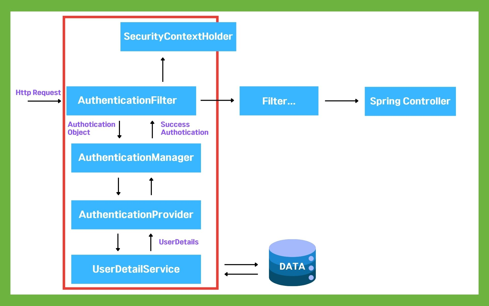
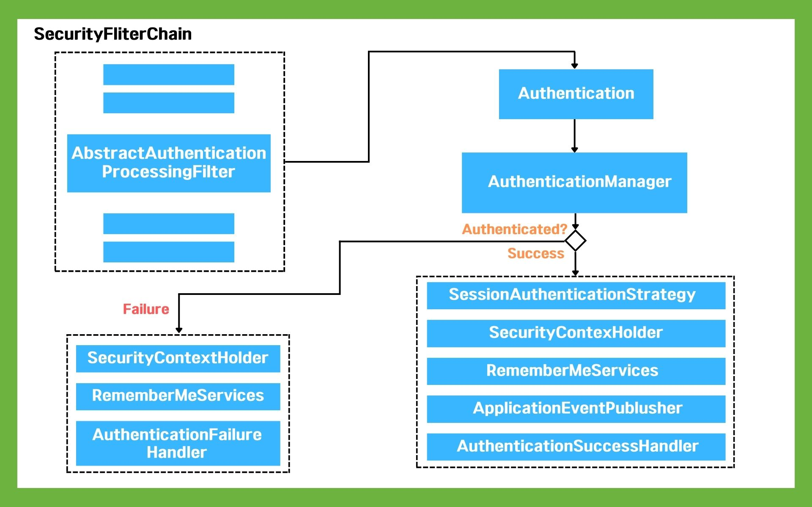

# 🗓️ 2025.06.16 (월) – 교육 일지

## 📚 오늘 배운 내용
### Spring Boot
#### 


## 💻 실습 예시
### Spring Security
- Spring Security란?
  - 스프링 시큐리티는 웹 어플리케이션의 보안, 특히 인증(Authentication)과 인가(Authorization)을 담당하는 Spring의 강력한 프레임 워크
  - 인증과 권한에 대한 부분을 Filter의 흐름에 따라서 처리
  - 보안과 관련된 옵션을 체계적으로 제공하므로 개발자가 일일이 보안과 관련된 로직을 작성하지 않아도 되는 장점이 있다.
- Spring Security 동작 흐름
  - 
    - (1) 사용자의 요청이 서버로 들어옴
    - (2) Authentication Filter가 요청을 가로채고 Authotication Manager로 요청 위임
    - (3) Authentication Manager는 등록된 Authotication Provider를 조회하며 인증 요구
    - (4) Authentication Provider가 실제 데이터를 조회하여 UserDetails 결과를 돌려줌
    - (5) 결과는 SecurityContextHolder에 저장이 되어 저장된 유저 정보를 Spring Controller에서 사용할 수 있게 됨.
- Spring Security가 작동하는 내부 구조 (AuthenticationFilter 내부의 동작 흐름)
  - 
    - (1) 사용자가 자격 증명 정보를 제출하면 AbstractAuthenticationProcessingFilter가 Authentication 객체 생성
    - (2) Authentication 객체가 AuthenticationManager에게 전달됨.
    - (3) 인증 실패 시 
      - (3-1) SecurityContextHolder의 값이 지워짐 
      - (3-2) RememberMeService.joinFail()이 실행됨.
      - (3-3) AuthenticationFailureHandler 실행 
    - (4) 인증 성공 시
      - (4-1) SessionAuthenticationStrategy가 새로운 로그인이 되었음을 알림
      - (4-2) Authentication이 SecurityContextHolder에 저장
      - (4-3) SecurityContextPersistenceFilter가 SecurityContext를 HttpSession에 저장하면서 로그인 세션 정보가 저장됨.
      - (4-4) RememberMeServices.loginSUccess() 실행
      - (4-5) ApplicationEventPublisher가 InteractiveAuthenticationSuccessEvent를 발생시키고 AuthenticationSuccessHandler가 실행됨
- Spring Security 설정
  - 의존성 추가
    ```
    implementation 'org.springframework.boot:spring-boot-starter-security'
    implementation 'org.thymeleaf.extras:thymeleaf-extras-springsecurity6'
    testImplementation 'org.springframework.security:spring-security-test'
    ```
    - Spring Security dependency를 받은 해당 애플리케이션은 어떠한 요청이든 인증을 해야만 응답을 받을 수 있다.
  - Security Configuration 클래스 설정
    - Bean으로 SecurityFilterChain 등록
    - `@EnableWebSecurity`를 통해 Spring Security를 Spring 애플리케이션에 활성화하는 역할을 하며, SecurityFilterChain을 직접 정의할 수 있도록 해준다.
    - 예시
      ```
      @Configuration
      @EnableWebSecurity
      public class SecurityConfiguration {

      @Autowired
      private AuthFailHandler authFailHandler;
  
      // 비밀 번호 암호화를 위한 Spring Security에서 제공하는 interface
      @Bean
      public PasswordEncoder passwordEncoder() {
          return new BCryptPasswordEncoder(); // 암호화를 위해 가장 많이 쓰는 알고리즘
      }
  
      @Bean
      public WebSecurityCustomizer webSecurityCustomizer() {
          // 정적인 데이터에는 무시
          return web -> web.ignoring()
                  .requestMatchers(PathRequest.toStaticResources().atCommonLocations());
      }
  
      @Bean
      public SecurityFilterChain configure(HttpSecurity http) throws Exception {
          /* 요청에 대한 권한 체크 */
          http.authorizeHttpRequests( auth -> {
              auth.requestMatchers("/auth/login", "/user/signup", "/auth/fail", "/", "/main").permitAll(); // 권한이 없어도 접근 가능
              auth.requestMatchers("/admin/*").hasAnyAuthority(UserRole.ADMIN.getRole()); // "/admin/*" 접근하기 위해서는 UserRole.ADMIN.getRole() 권한을 가지고 있어야함.
              auth.requestMatchers("/user/*").hasAnyAuthority(UserRole.USER.getRole());
              auth.anyRequest().authenticated(); // 다른 요청에 대해서는 인증된 사용자만 허용 (permitAll과 반대)
          })
          ...
      }
      ```
  - Spring Security 인증, 인가 처리
    - 사용자 정보 객체는 UserDetails를 구현한 클래스
    - UserDatailService 객체를 통해 인증, 인가 처리 등의 사용자 정보 관리를 한다.
    - 권한(Role) 정보도 이 안에서 함께 처리됨
- 전체 흐름 요약
  - 클라이언트가 로그인을 시도 → AuthenticationManager가 UserDetailsService를 통해 사용자 정보 조회 → 비밀번호 확인 → 권한 부여 → 인증 완료

## ✍️ 오늘의 회고
- 앱개발 당시 직접 인증 정보를 적었던 것에 비하면 Spring Security를 통해 비교적 수월하게 로그인 / 회원관리를 할 수 있다는 것을 느꼈다.
- 하지만 설정을 완벽히 이해하려면 아직 갈 길이 멀다...